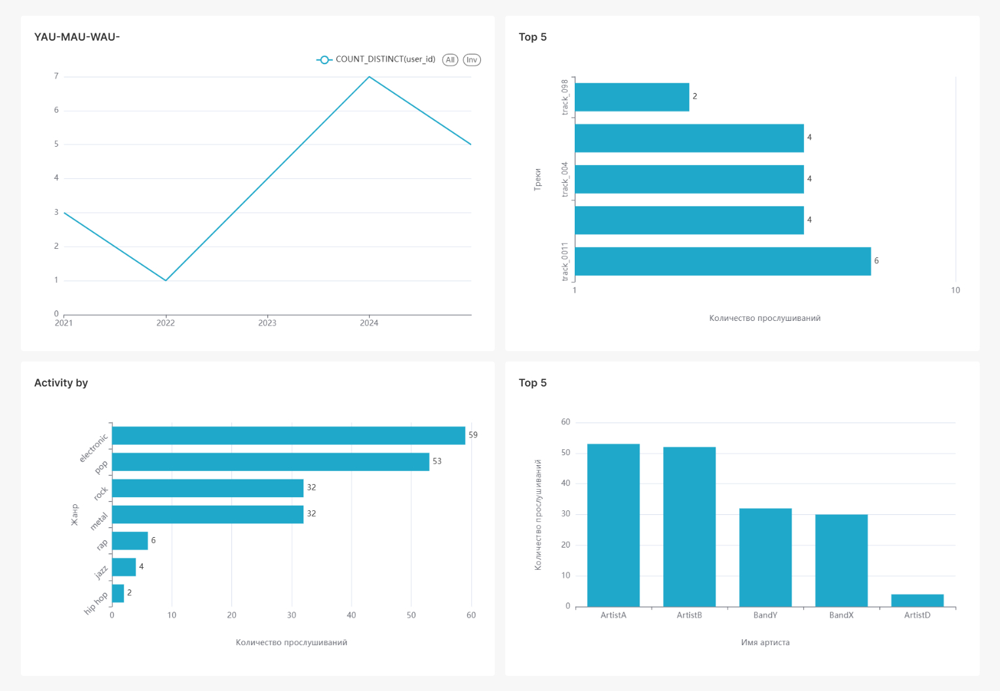

# ETL Pipeline with PostgreSQL, Debezium, Kafka, Spark и ClickHouse

Реализация ETL-пайплайна для обработки данных в реальном времени с использованием:

- **PostgreSQL** - источник данных
- **Debezium** - CDC (Change Data Capture)
- **Kafka** - потоковый брокер
- **Spark Structured Streaming** - обработка данных
- **ClickHouse** - аналитическая СУБД
- **Superset** - платформа для визуализации данных

## Запуск проекта

1. Клонировать репозиторий:
```bash
git clone https://github.com/yourusername/etl5.git
```
2. Перейти в каталог
```bash
cd etl5
```
3. Запустить все сервисы:
```bash
docker-compose up -d
```
4. Запускаем spark
```bash
docker exec -it etl5-spark-master-1 spark-submit --packages org.apache.spark:spark-sql-kafka-0-10_2.12:3.5.0 /app/main.py
```

5. Загрузим зависимости
```bash
pip install -r requirements.txt
```

6. Запустим ex.py
```bash
python ex.py
```

## Проверка работы

1. Вставить тестовые данные в PostgreSQL:

```bash
docker exec -it etl5-postgres-1 psql -U user -d mydb


INSERT INTO playlist_events (event_id, event_type, playlist_id, track_id, user_id, timestamp)
VALUES 
(391771, 'TrackAddedToPlaylist', 76, 9308, 741105, NOW());
```


2. Проверить данные в ClickHouse:

```bash
docker exec -it etl5-clickhouse-1 clickhouse-client

SELECT * FROM test.playlist_events
```


```
3. Можно перейти по http://localhost:8088

4. Логинимся

Вводим:

```
Login: admin

Password: admin
```
5. Создаём подключение

Вводим:

```
HOST: clickhouse

PORT: 8123

Database name: test

USERNAME: default

Password: (пусто)

Display name: ClickHouse Test
```

6. Создаём dashboard

*В верхнем чаре можно подвигать ползунок и поменять YAU на MAU, DAU*



## Архитектура
```
PostgreSQL → (Debezium) → Kafka → Spark Streaming → ClickHouse -> Superset
```


